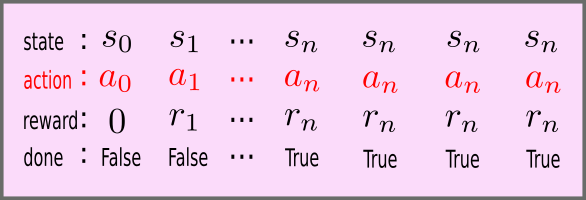
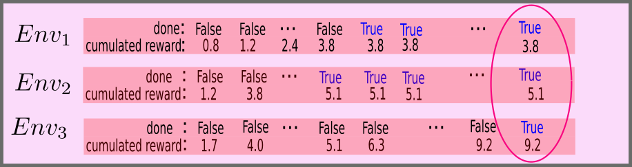
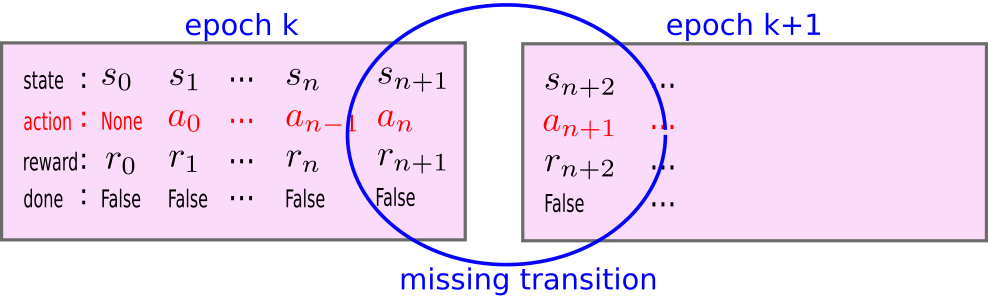
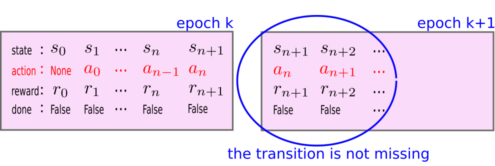
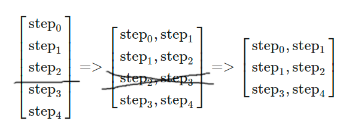
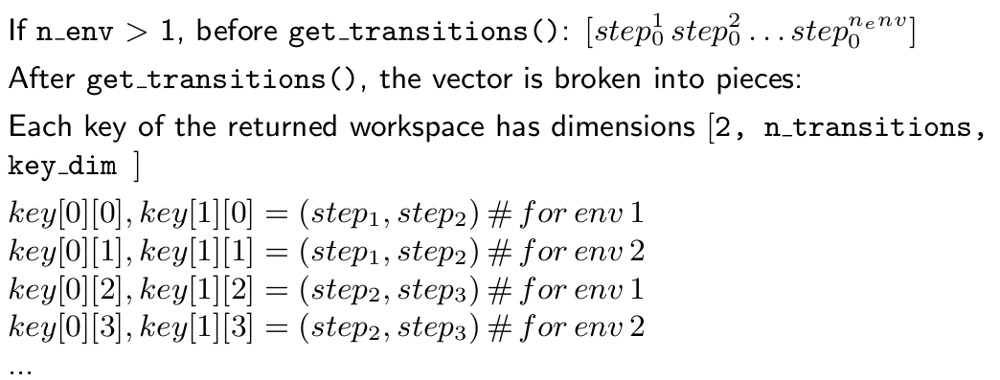

# Multiple environments and autoreset

One efficient way to accelerate and improve the stability of RL is to let agents collect data in several environments at the same time. This can be done with a multiprocessing approach or a single process approach.

The basic idea is that, instead of interacting with a single environment, the agent can interact with a vector of environments, receiving a vector of observations and rewards and sending a vector of actions. This looks the same as performing several interaction loops over several single environments, but this can be computed faster just by leveraging the capability of python to efficiently deal with large vectors and matrices, particularly when computing with a GPU.

However, such use of parallel environments raises specific issues.

The main issue is that it is often the case that different episodes in the same environment do not last the same number of time steps. For instance, in the CartPole environment, the goal is to keep a pole up as long as possible, so the episode of a failing agent may last only a few steps (the minimum is 7) whereas a successful agent may keep it up until a predetermined time limit, e.g. 500 times steps.

So, if the agent is collecting data in parallel from a vector of environments, what should it do?

If it performs just one episode at a time for all environments, some environments will stop earlier than others and data collection with these environment will be staled until the last environment stops.  This is what the `autoreset=False` option is designed for.

There are contexts where it is appropriate to do this (e.g. for statistically evaluating agents) but, in most contexts, one can see this as a waste of time.

The other option consists in collecting data for a fixed number of steps, rather than a number of episodes and restarting (resetting) each environment each time it stops, until  the specified number of steps is reached. This way, there is no waste of time. This is what the `autoreset=True` option is designed for.

## The `autoreset=False` case

In BBRL, GymAgents can run several environments in parallel. But when using `autoreset=False`, a stopped environment is not restarted until the other ones have all finished.

So, instead of specifying a number of time steps, the `autoreset=False` case can be used in conjunction with a `stop variable`: data collection stops as soon as the stop variable is `True` for all environments. The standard use case consists in using "env/done" as stop variable.

A specificity of the `autoreset=False` case is that once an environment is done, if other environments are not done, the data from the last step of the environment is copied into the collected data for the next time steps until the end, as illustrated below.

As shown below, this facilitates checking if all environments are done and getting the cumulated reward for each just by looking into the last time step.

To practice about all these aspects of using a ParallelGymAgent with `autoreset=False`, you should play with [this notebook](notebooks/02-multi_env_noautoreset.student.ipynb).

## The `autoreset=True` case

The `autoreset=True` case is the case where a next episode is started as soon as an episode stops. In that case, there may be no obvious stopping variable or condition. Instead, we run the environments for n steps.

Collecting data for n steps offers the possibility to process this data (e.g. training the RL agent from this data) and to go back to data collection until a global training budget is elapsed. The n steps data collection part is called an epoch.

The collection model based on epochs faces the following list of issues:

- In general, the end of an epoch does not coincide with the end of all episodes. When an epochs ends before an episode stops, a specific treatment is needed to avoid loosing data from an epoch to the next. This is explained in the <a href="#binding">Binding together data collection epochs from the same episode</a> section.
- Data from an epoch may contain several successive episodes, and the transition from an episode to the next should not be considered as a training transition, it must be properly ignored by the training process. This is explained in the <a href="#dealing">Dealing with transitions from one episode to the next</a> section.
- An episode may stop either because the corresponding task is done, or because a time limit has been reached. This also requires a specific treatment. See <a href="time_limits.md">here</a> for more information about this issue.

<h3 id="binding">Binding together data collection epochs from the same episode</h3>

When moving from a data collection epoch to the next, the transition from the last state of the previous epoch to the first state of the next epoch should not be ignored when processing the data, which is what would happen if we do nothing. This is illustrated below.

The right way to fix this issue is to copy the last time step frame of the previous epoch into the first time step frame of the next epoch. That way, the potentially missing transition will be present in the first two frames of the second epoch. This is illustrated below.

This mechanism is implemented using `train_workspace.copy_n_last_steps(1)` as shown at the bottom of [this notebook](notebooks/03-multi_env_autoreset.student.ipynb).

Note that `train_workspace.zero_grad()` is used to clean all gradients in the workspace before processing the new data that will be collected.

<h3 id="dealing"> Dealing with transitions from one episode to the next</h3>

A second issue arises when the `autoreset=True` mechanism switches from episode `k` to episode `k+1` inside an epoch. The transition from the last step of episode `k` to the first step of episode `k+1` should be ignored, as it does not truly correspond to a step of the agent.

The appropriate way to deal with this difficulty consists in replacing single step informations with transition informations, and removing the transitions whose first step is the end of an episode and whose second step is the beginning of the second episode.

In practice, the sequence of steps built in the workspace is duplicated to constitute a sequence of pairs, as illustrated below. All informations of each step are duplicated: the state, the reward, the terminated, truncated and done variables, the current time and the cumulated reward.

Then all the transitions where the first step is done are removed. In the example below, the [step 2, step 3] transition is removed because it verifies this condition, resulting in the final list.

Fortunately, because of the duplication, no step information is lost (in the final list you find from step 0 to step 4), thus we can find the end of episodes by looking at the value of done in the second part of the pairs.

The function which performs this reorganization and filtering of transitions is the `get_transition()` function in the `Workspace` class.

Given the organization into pairs of step informations, the way to access data is a little different. To know whether an episode is done, the information is in the second part of the pair, so one should use `done[1]`. Similarly, to get V(st+1), one should use `critic[1]`. By contrast, to get the reward or the value of the critic at the current state, one should use `reward[0]` or `critic[0]`.

By chance, given that the pairs have two elements, `reward[1` is equivalent to `reward[1:]` (all rewards but the first) and `critic[1]` is equivalent to `critic[1:]`, thus it happens that for temporal difference updates, the code in the `autoreset=True` case is equivalent to the code in the `autoreset=False` case.

Note that we also have to organize the variables from the list of environments.
The list is organized as visualized below.

To practice about all these aspects of using a ParallelGymAgent with `autoreset=True`, you should play with [this notebook](notebooks/03-multi_env_autoreset.student.ipynb).
