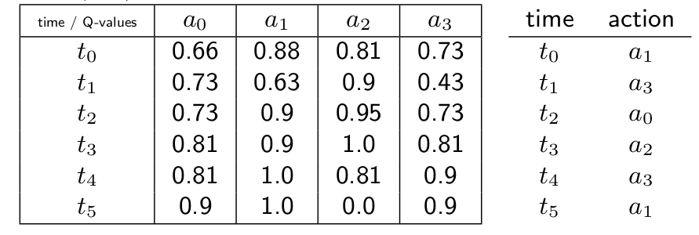
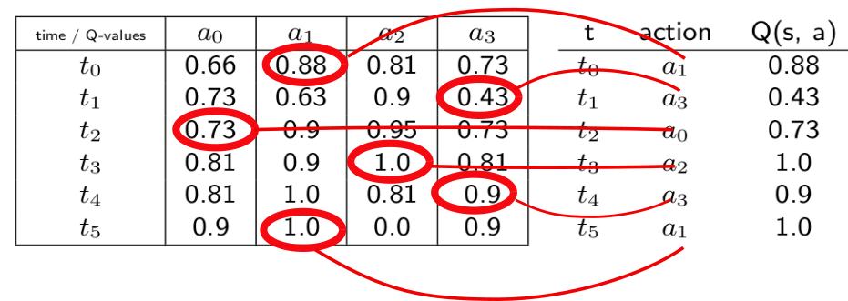

# Using torch.gather()

In DQN and similar value-based RL algorithms, we need to perform Bellman backups to update the critic:

$Q(s_t, a_t) =  Q(s_t, a_t) + \alpha \[r_{t+1} + \gamma \max_{a \in A} Q(s_{t+1}, a) - Q(s_t, a_t)\]$

The function in charge of this receives a tensor of Q-values of all actions through time and the actions of the agent at the same time, as shown below.

To get the Q(s,a) value at each step from this data, we need to use torch.gather.

What we want to do is illustrated below.

If life was simple, we would just use something simple like `torch.gather(q-values, actions)`...
But life is not simple!

In practice, the actions Tensor is organized this way: $[a_1\, a_3\, a_0\, a_2\, a_3\, a_1]$. But we need them to be organized this way: $[[a_1][a_3][a_0][a_2][a_3][a_1]]$.

So, to get the adequate indexes, we need to use `actions.unsqueeze(-1)`.

Besides, `torch.gather()` does produce a Tensor like this: $[[q_1][q_3][q_0][q_2][q_3][q_1]]$. But we need a Tensor like this: $[q_1, q_3, q_0, q_2, q_3, q_1]$.

So we use something like `qvals = qvalues.gather(some params...).squeeze(-1)`.

##  Using torch.gather(): autoreset=False or True

The gather function takes two params: the dimension along which we want to gather data, and the tensor of indexes.

The dimension along which we want to gather data is actions.

When `autoreset=False`, the Q-values tensor is a (T x B x A) tensor: T for time, B for batch (i.e. the number of envs), and A for actions.

Thus actions are at dimension 2.

So we use `qvals = qvalues.gather(dim=2, index=actions.unsqueeze(-1)).squeeze(-1)`.

When `autoreset=True`, the Q-values tensor is a (2 x B x A) tensor.

Thus, if we consider the `qvalues[0]` tensor, actions are at dimension 1.

This time we use `qvals = torch.gather(qvalues[0], dim=1, index=actions.unsqueeze(-1)).squeeze(-1)`.

Note the use of `torch.gather()` instead of `qvalues.gather()`, both are equivalent.
